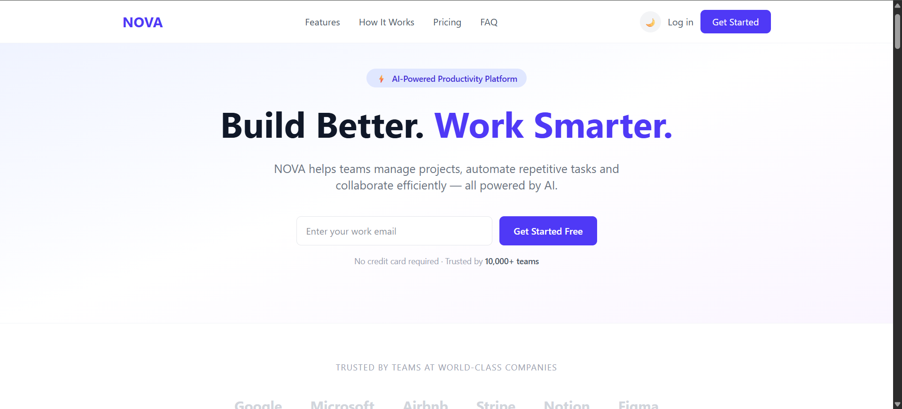
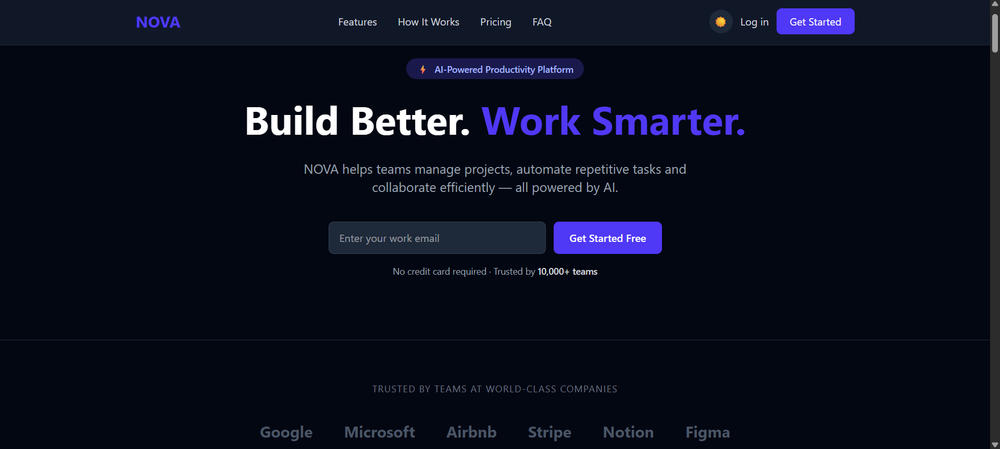

# NOVA — AI Productivity Platform

A fully responsive, modern landing page built for NOVA — an AI-powered productivity platform that helps teams manage projects, automate repetitive tasks and collaborate efficiently.

## Live Demo

[View Live Site](https://nova-seven-peach.vercel.app)

---

## Technologies Used

- **React 18** — Component-based UI
- **Vite** — Fast development build tool
- **Tailwind CSS v4** — Utility-first styling
- **JavaScript (ES6+)** — Logic and interactivity

---

## Features

- Fully responsive — Mobile, Tablet, Desktop
- Dark / Light mode toggle
- Animated statistics counter (IntersectionObserver)
- Testimonial carousel with dot navigation
- Monthly / Annual pricing toggle
- FAQ accordion
- Email validation in Hero and CTA sections
- Smooth scrolling navigation
- Back to top button
- Mobile hamburger menu with animation

---

## Project Structure
Nova/
├── public/
├── src/
│ ├── components/
│ │ ├── Navbar.jsx
│ │ ├── Hero.jsx
│ │ ├── TrustedBy.jsx
│ │ ├── Features.jsx
│ │ ├── About.jsx
│ │ ├── HowItWorks.jsx
│ │ ├── Stats.jsx
│ │ ├── Solutions.jsx
│ │ ├── Testimonials.jsx
│ │ ├── Pricing.jsx
│ │ ├── FAQ.jsx
│ │ ├── CTA.jsx
│ │ └── Footer.jsx
│ ├── data.js
│ ├── App.jsx
│ ├── main.jsx
│ └── index.css
├── index.html
├── vite.config.js
└── package.json

---

## Installation & Setup

Follow these steps to run the project locally:

**1. Clone the repository**
```bash
git clone https://github.com/your-username/nova.git
```

**2. Enter the project folder**
```bash
cd nova
```

**3. Install dependencies**
```bash
npm install
```

**4. Start development server**
```bash
npm run dev
```

**5. Open in browser**
http://localhost:5173


---

## Screenshots

### Light Mode


### Dark Mode


---

## AI Tools Used

- **Claude (Anthropic)** — Used for code assistance, component structure suggestions and debugging help. All code was reviewed, understood and manually implemented.

---

## Sections Included

| Section | Description |
|---|---|
| Navbar | Responsive navigation with mobile hamburger menu |
| Hero | Main headline with email validation |
| Trusted By | Company logos section |
| Features | 6 feature cards with hover effects |
| About | Two-column product section |
| How It Works | 4-step process with connector lines |
| Stats | Animated counters with IntersectionObserver |
| Solutions | 4 use case cards |
| Testimonials | Carousel with prev/next navigation |
| Pricing | 3 plans with monthly/annual toggle |
| FAQ | Accordion with 6 questions |
| CTA | Final conversion section with email input |
| Footer | Multi-column footer with links |

---

## Accessibility

- Semantic HTML tags — `nav`, `main`, `section`, `footer`
- `aria-label` on all icon buttons
- `aria-expanded` on FAQ accordion and hamburger menu
- `role` attributes on menus and lists
- Keyboard navigable components

---

## Design Decisions

- **Indigo + Purple** color palette — professional and modern
- **Consistent spacing** — 24px section padding throughout
- **Card hover effects** — shadow + translate-y lift
- **Dark mode** — full site coverage with smooth transition
- Alternating section backgrounds — white and gray-50 for visual separation

---

## Performance

- No external image dependencies
- Minimal third-party libraries
- Component-based architecture for code splitting
- Lazy-loadable structure

---

*Built with React + Vite + Tailwind CSS*